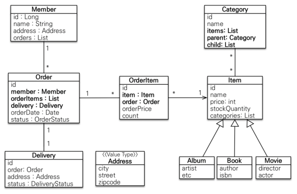
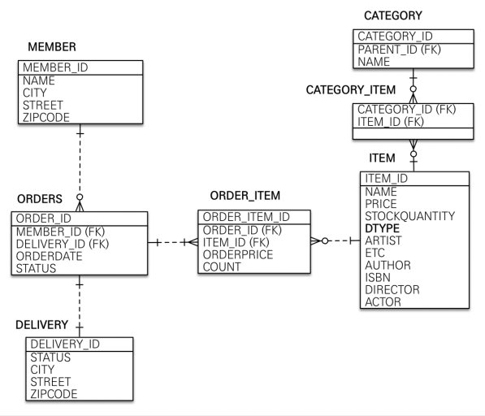
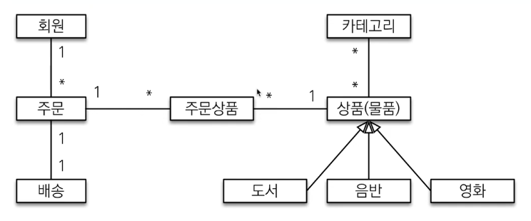

# 스프링 부트 + JPA 실전 예제

인프런 김영한님의 실전! 스프링 부트와 JPA 활용1을 들으며 따라 만드는 프로젝트입니다.

## 환경

- spring boot 2.7.3
- jdk 11
- intellij
- Dependencies
    - Spring Web
    - Thymeleaf
    - Spring Data JPA
    - H2 Database
    - Lombok
        - Lombok을 깔면 Preferences - Build, Execution, Deployment - Compiler - Annotation Processors - Enable annotation
          procession에 체크를 해줘야 한다.

## 도메인 분석 설계

### 요구사항 분석

실제 동작하는 화면을 먼저 확인한다.

기능 목록

- **회원 기능**
    - 회원 등록
    - 회원 조회
- **상품 기능**
    - 상품 등록
    - 상품 수정
    - 상품 조회
- **주문 기능**
    - 상품 주문
    - 주문 내역 조회
    - 주문 취소
- **기타 요구사항**
    - 상품은 재고 관리가 필요하다.
    - 상품의 종류는 도서, 음반, 영화가 있다.
    - 상품을 카테고리로 구분할 수 있다.
    - 상품 주문시 배송 정보를 입력할 수 있다.

### 도메인 모델과 테이블 설계

회원, 주문, 상품의 관계: 회원은 여러 상품을 주문할 수 있다. 그리고 한 번 주문할 때 여러 상품을 선택할 수
있으므로 주문과 상품은 다대다 관계다. 하지만 이런 다대다 관계는 관계형 데이터베이스는 물론이고 엔티
티에서도 거의 사용하지 않는다. 따라서 그림처럼 주문상품이라는 엔티티를 추가해서 다대다 관계를 일대
다, 다대일 관계로 풀어냈다.

상품 분류: 상품은 도서, 음반, 영화로 구분되는데 상품이라는 공통 속성을 사용하므로 상속 구조로 표현했
다.

### 회원 엔티티 분석

- 회원(Member): 이름과 임베디드 타입인 주소( Address ), 그리고 주문( orders ) 리스트를 가진다.
- 주문(Order): 한 번 주문시 여러 상품을 주문할 수 있으므로 주문과 주문상품( OrderItem )은 일대다 관계
  다. 주문은 상품을 주문한 회원과 배송 정보, 주문 날짜, 주문 상태( status )를 가지고 있다. 주문 상태는 열
  거형을 사용했는데 주문( ORDER ), 취소( CANCEL )을 표현할 수 있다.
- 주문상품(OrderItem): 주문한 상품 정보와 주문 금액( orderPrice ), 주문 수량( count ) 정보를 가지고
  있다. (보통 OrderLine , LineItem 으로 많이 표현한다.)
- 상품(Item): 이름, 가격, 재고수량( stockQuantity )을 가지고 있다. 상품을 주문하면 재고수량이 줄어든
  다. 상품의 종류로는 도서, 음반, 영화가 있는데 각각은 사용하는 속성이 조금씩 다르다.
- 배송(Delivery): 주문시 하나의 배송 정보를 생성한다. 주문과 배송은 일대일 관계다.
- 카테고리(Category): 상품과 다대다 관계를 맺는다. parent , child 로 부모, 자식 카테고리를 연결한
  다.
- 주소(Address): 값 타입(임베디드 타입)이다. 회원과 배송(Delivery)에서 사용한다.

> 참고: 회원 엔티티 분석 그림에서 Order와 Delivery가 단방향 관계로 잘못 그려져 있다. 양방향 관계가 맞
> 다.

> 참고: 회원이 주문을 하기 때문에, 회원이 주문리스트를 가지는 것은 얼핏 보면 잘 설계한 것 같지만, 객체 세
> 상은 실제 세계와는 다르다. 실무에서는 회원이 주문을 참조하지 않고, 주문이 회원을 참조하는 것으로 충분
> 하다. 여기서는 일대다, 다대일의 양방향 연관관계를 설명하기 위해서 추가했다.

### 회원 테이블 분석

- MEMBER: 회원 엔티티의 Address 임베디드 타입 정보가 회원 테이블에 그대로 들어갔다. 이것은
  DELIVERY 테이블도 마찬가지다.
- ITEM: 앨범, 도서, 영화 타입을 통합해서 하나의 테이블로 만들었다. DTYPE 컬럼으로 타입을 구분한다.

> 참고: 테이블명이 ORDER 가 아니라 ORDERS 인 것은 데이터베이스가 order by 때문에 예약어로 잡고 있
> 는 경우가 많다. 그래서 관례상 ORDERS 를 많이 사용한다.

> 참고: 실제 코드에서는 DB에 소문자 + _(언더스코어) 스타일을 사용하겠다.
> 데이터베이스 테이블명, 컬럼명에 대한 관례는 회사마다 다르다. 보통은 대문자 + _(언더스코어)나 소문자 +  _(언더스코어) 방식 중에 하나를 지정해서 일관성 있게 사용한다. 강의에서 설명할 때는 객체와 차이를
> 나타내기 위해 데이터베이스 테이블, 컬럼명은 대문자를 사용했지만, 실제 코드에서는 소문자 + _(언더스코어) 스타일을 사용하겠다.

### 연관관계 매핑 분석

- 회원과 주문: 일대다 , 다대일의 양방향 관계다. 따라서 연관관계의 주인을 정해야 하는데, 외래 키가 있는 주
  문을 연관관계의 주인으로 정하는 것이 좋다. 그러므로 Order.member 를 ORDERS.MEMBER_ID 외래 키와 매핑한다.
- 주문상품과 주문: 다대일 양방향 관계다. 외래 키가 주문상품에 있으므로 주문상품이 연관관계의 주인이다.
  그러므로 OrderItem.order 를 ORDER_ITEM.ORDER_ID 외래 키와 매핑한다.
- 주문상품과 상품: 다대일 단방향 관계다. OrderItem.item 을 ORDER_ITEM.ITEM_ID 외래 키와 매핑한
  다.
- 주문과 배송: 일대일 양방향 관계다. Order.delivery 를 ORDERS.DELIVERY_ID 외래 키와 매핑한다.
- 카테고리와 상품: 강의에선 간단하게 @ManyToMany 를 사용해서 매핑했지만. 이 프로젝트는 실무에 가깝게 하기 위해 CategoryItem 엔티티를 따로 생성해서 ManyToOne, OneToMany 로
  엮었다.

> **참고: 외래 키가 있는 곳을 연관관계의 주인으로 정해라.** 연관관계의 주인은 단순히 외래 키를 누가 관리하냐의 문제이지 비즈니스상 우위에 있다고 주인으로 정하면
> 안된다.. 예를 들어서 자동차와 바퀴가 있으면, 일대다 관계에서 항상 다쪽에 외래 키가 있으므로 외래 키가
> 있는 바퀴를 연관관계의 주인으로 정하면 된다. 물론 자동차를 연관관계의 주인으로 정하는 것이 불가능 한
> 것은 아니지만, 자동차를 연관관계의 주인으로 정하면 자동차가 관리하지 않는 바퀴 테이블의 외래 키 값이
> 업데이트 되므로 관리와 유지보수가 어렵고, 추가적으로 별도의 업데이트 쿼리가 발생하는 성능 문제도 있
> 다.

## 엔티티 설계시 주의점

### 엔티티는 가급적 Setter 를 사용하지 말자

- setter가 모드 열려있으면 변경 포인트가 너무 많아서 유지보수가 너무 어렵다
- 강의에선 편의를 위해 모든 setter를 열어뒀지만 이 프로젝트에서는 가급적이면 setter를 열어두지 않았다.

### 모든 연관관계는 지연로딩으로 설정

- 즉시로딩(EAGER)는 예측이 어렵고, 어떤 SQL이 실행될지 추측하기 어렵다. 특히 JPQL을 실행할 때 N + 1 문제가 자주 발생한다.
- 실무에서 모든 연관관계는 지연로딩(LAZY)으로 설정해야 한다.
- 연관된 엔티티를 함께 DB에서 조회해야 한다면 fetch join 또는 엔티티 그래프 기능을 사용한다.
- @XxxToOne 관계는 기본이 즉시로딩이므로 직접 지연로딩으로 설정해야 한다.

### 컬렉션은 필드에서 초기화하자

- null 문제에서 안전하다
- 하이버네이트는 엔티티를 영속화 할 때 컬랙션을 감싸서 하이버네이트가 제공하는 내장 컬렉션으로 변경한다. 만약 임의의 메서드에서 컬렉션을 잘못생성하면 하이버네이트 내부 메커니즘에 문제가 발생할 수 있다. 따라서
  필드레벨에서 생성하는 것이 가장 안전하고 코드도 간결하다.

### 기본 생성자를 protected로 설정하자.

- 기본 생성자로 객체를 생성하고 setter등으로 채워넣으면 유지보수가 힘들어진다.
    - 기본 생성자를 protected로 설정하고 객체 생성 방법을 통일해서 유지보수하기 쉽게 만들자.

## 주문

> 주문 서비스의 주문과 주문 취소 메서드를 보면 비즈니스 로직 대부분이 엔티티에 있다. 서비스 계층 은 단순히 엔티티에 필요한 요청을 위임하는 역할을 한다. 이처럼 엔티티가 비즈니스 로직을 가지고 객체 지
> 향의 특성을 적극 활용하는 것을 **도메인 모델 패턴**(http://martinfowler.com/eaaCatalog/domainModel.html)이라 한다. 반대로 엔티티에는 비즈니스 로직이 거의 없고
> 서비스
> 계층에서 대부분 의 비즈니스 로직을 처리하는 것을 **트랜잭션 스크립트 패턴**(http://martinfowler.com/eaaCatalog/transactionScript.html)이라 한다.

## 동적 쿼리

- jpql 으로 if문을 사용하여 문자열을 합성해서 동적쿼리
    - 가독성이 떨어지고 구현이 복잡하고 실수로 인한 버그 발생 가능성이 매우 높음
- Criteria 사용
    - JPA 표준스팩이고 jpql을 사용하는 것 보단 낫지만, 유지보수성이 힘들고 가독성이 떨어짐.
- Querydsl 사용

## 변경 감지와 병합

### 변경 감지 (dirty checking)

- 영속성 컨텍스트에서 엔티티를 조회한 후에 영속상태인 엔티티를 수정.

### 병합 (merge)

- em.merge()
- 준영속 엔티티의 식별자 값으로 영속 엔티티를 조회.
- 영속 엔티티의 값을 준영속 엔티티의 값으로 모두 교체한다.

> **주의**: 변경 감지 기능을 사용하면 원하는 속성만 선택해서 변경할 수 있지만, 병합을 사용하면 모든 속성이 변경된다.
> 병합시 값이 없으면 null로 업데이트 할 위험도 있다. (merge 는 모든 필드를 교체한다.)
> **엔티티를 변경할 떄는 항상 변경 감지(dirty checking) 을 사용하자.**

## 메모

@PersistenceContext

- 다른 설정 필요 없이 EntityManager 를 주입해줌.

@Transactional

- spring 라이브러리를 사용하는 것을 권장.
- @Transactional 이 붙은 클래스와 메서드는 트랜잭션 처리가 된다.
- test에 @Transactional 어노테이션이 붙으면 테스트가 끝나고 롤백을 한다.
- 롤백을 하기 싫으면 @Rollback(false) 를 달면 된다.

### Service단에서 id를 넘겨받아 조회하는 이유

- controller단에서 entity를 조회해서 service단으로 넘기면 Service단의 Transaction 바깥에서 조회했기 때문에 영속 상태가 애매해진다.
    - controller에선 엔티티를 넘겨주지 말고 id정도만 넘겨주고 Service의 Transaction 안에서 비지니스 로직을 처리하는 것이 좋다.

### 테스트

테스트 패키지에 resources 폴더를 만들어 설정 파일을 생성해 테스트의 설정 파일을 따로 만드는게 좋다.

- 테스트 DB는 인메모리를 사용하자